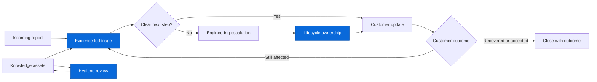

# Support Operations Architecture

This fictional reference architecture shows how the public projects in this
portfolio fit together. It represents an engineering approach, not an employer
workflow or customer process.

## Public Tool Map

| Lifecycle stage | Public project | Contribution |
| --- | --- | --- |
| Evidence-led triage | `support-engineering-portfolio` | Synthetic incident triage and escalation-readiness CLIs. |
| Workflow and security review | `github-actions-workflow-auditor` | Static CI/CD checks with structured findings. |
| Appliance first look | `gh-bundle` | Read-only, source-oriented GHES bundle triage. |
| Escalation continuity | `escalation-lifecycle-guard` | Checks ownership, update cadence, customer path, close outcome, and OOO coverage. |
| Knowledge maintenance | `support-knowledge-hygiene` | Checks knowledge asset ownership, freshness, usage, and duplicate-content risk. |
| Reproduction design | `cs-merge-protection-repro` | Isolates complex behavior into a small, testable scenario. |

## Design Principles

1. Preserve source evidence and label uncertainty.
2. Convert recurring work into checks, tooling, or durable documentation.
3. Keep technical investigation and customer continuity connected.
4. Make closure an outcome decision, not a timeout.
